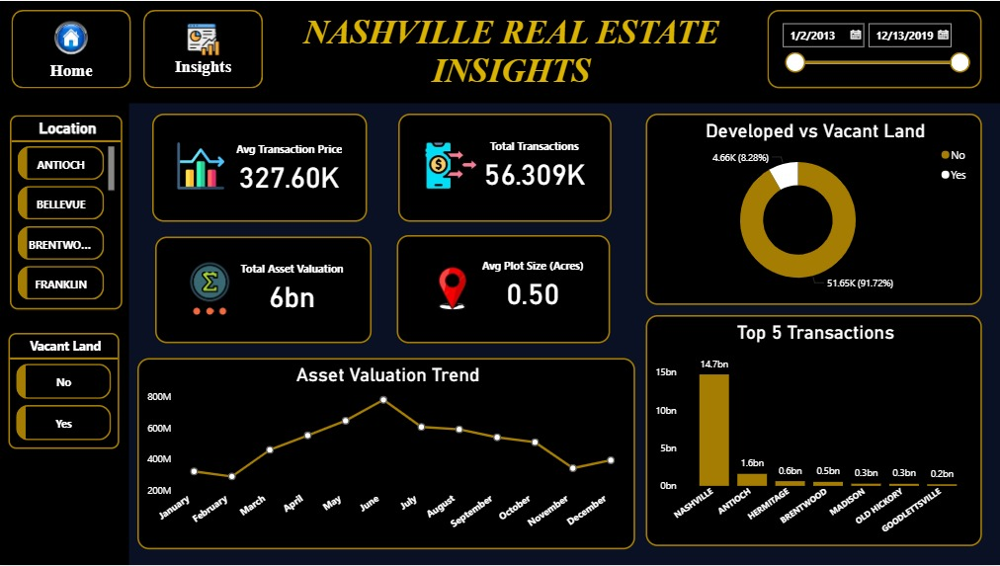

# 🏢 Nashville Housing Market: Data Cleaning & Multi-Page Executive Insights

## 📌 Project Overview
This project showcases an end-to-end data engineering and business intelligence workflow. Using a comprehensive dataset of over 56,000 Nashville real estate transactions, I executed extensive data cleaning, schema refinement, and optimizations within a **PostgreSQL** database. Following the data engineering layer, I developed a premium, low-light executive analytics platform in **Power BI** utilizing a dedicated entry screen and a main data analysis dashboard.

## 🛠️ Tools Used
* **Database Backend:** PostgreSQL / SQL Server
* **Data Visualization & Modeling:** Power BI Desktop
* **Design Theme:** Premium Midnight Navy (`#0A1124`) with Metallic Gold (`#D4AF37`) Accent Highlights

## 📂 Repository Structure
* `/SQL_scripts`: Contains structured documentation for deep data cleaning, address parsing, and the final master view configuration (`Nashville_housing.sql`).
* `/power_bi`: Houses the production-ready `.pbix` dashboard workspace and relational data model.

---

## 📊 Dashboard Visuals & Insights

### 1. Welcome Home Screen (`Property_Home_page.jpeg`)
*The Home Page functions as a sleek, minimalist landing screen built exclusively for user onboarding and interface navigation.*
* **Navigation-Driven UX:** Uses custom page-navigation controls and interactive buttons to create a smooth web-app feel, allowing stakeholders to transition cleanly into the core analytics report.
* **Minimalist Aesthetics:** Keeps the canvas ultra-clean, establishing the high-end dark background and design language before revealing the data.

### 2. Executive Analytics Dashboard (`property_main_page.jpeg`)
*The Main Page serves as the primary command center where all real estate metrics, market volume, and asset valuations are aggregated and tracked.*
* **The 4-KPI Executive Ribbon:** Features a streamlined row of metrics across the top of the dark canvas, utilizing gold accent headers and crisp white data points:
  * `TOTAL TRANSACTIONS` (Distinct Count of Unique ID): Tracks market trade velocity and total closed deals.
  * `AVG MARKET SALE PRICE` (Average of Sale Price): Monitors what buyers are actually paying on average.
  * `TOTAL MARKET ASSET VALUE` (Sum of Total Value): Captures the combined building and land worth of the real estate portfolio.
  * `AVERAGE ACREAGE` (Average of Acreage): Tracks physical plot size footprints across Nashville zones.
* **Trend & Geographic Analysis:** Houses high-contrast visuals—including your historical line chart charting market trajectory over time, along with deep-dives into regional metrics and inventory segmentation (developed properties vs. vacant land).

---

## ⚙️ Data Engineering & Cleaning Process (SQL)
To ensure absolute data integrity prior to reporting, the raw dataset underwent rigorous cleaning transformations in SQL:
* **Standardizing Data Formats:** Converted irregular date strings into explicit date structures.
* **Address Parsing & Normalization:** Leveraged advanced string manipulation functions to break down unformatted property and owner location fields into distinct, queryable `Address`, `City`, and `State` attributes.
* **Field Optimization:** Standardized boolean/flag fields (such as `SoldAsVacant`) to uniform, clean target inputs (`Yes` / `No`) for seamless categorical slicing.
* **Duplicate Purging:** Utilized window functions (`ROW_NUMBER()`) alongside Common Table Expressions (CTEs) to isolate and eliminate redundant records safely without corrupting unique keys.
* **Master View Construction:** Synthesized the final cleaned data layer into a singular, high-performance master view optimized for lightning-fast Power BI direct import and memory efficiency.
